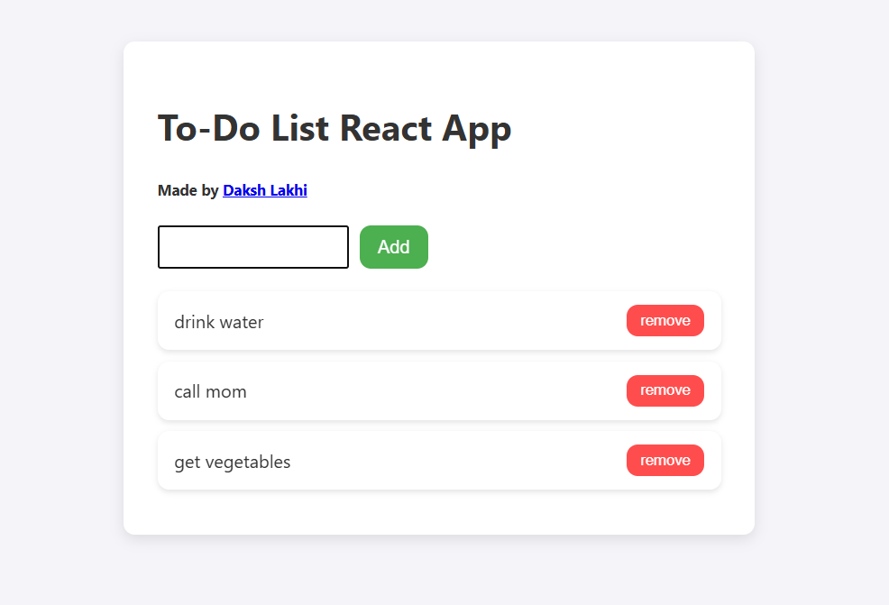

# 📝 React To-Do App

A simple, elegant, and fast To-Do list app built using **React + Vite**. This app helps users organize their tasks with ease and smooth performance. 

🔗 **Live Demo**: [react-to-do-app-dl1.netlify.app](https://react-to-do-app-dl1.netlify.app)

---

---

## 🚀 Features

- ✅ Add new tasks
- ✅ Mark tasks as complete/incomplete
- ✅ Delete tasks
- ✅ Persistent task state with React hooks
- ✅ Clean, modern UI with responsive design

---

## 🛠️ Built With

- [React](https://reactjs.org/)
- [Vite](https://vitejs.dev/)
- [JavaScript](https://developer.mozilla.org/en-US/docs/Web/JavaScript)
- [HTML5](https://developer.mozilla.org/en-US/docs/Web/Guide/HTML/HTML5)
- [CSS3](https://developer.mozilla.org/en-US/docs/Web/CSS)

---